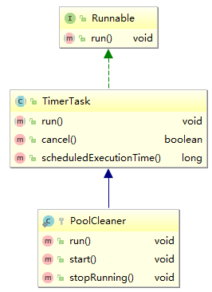
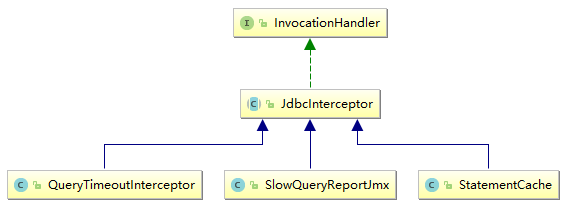
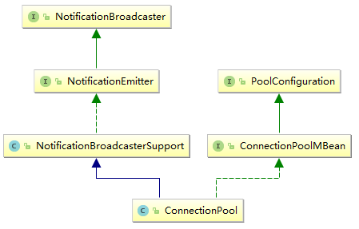
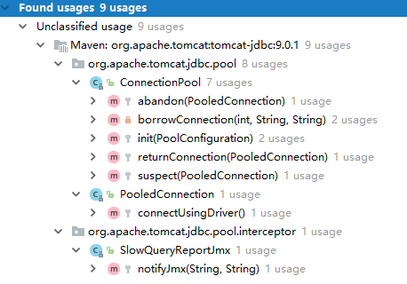

# 目的

通过阅读tomcat-jdbc的源码以学习一个数据库，或者可以扩展到更广意义上的连接池的实现。选择tomcat-jdbc的原因是足够的轻量，
源码足够的简洁，同时又不失核心的功能。

本工程基于JDK 9构建，在JDK 8上不需要额外的引入多余的依赖便可以使用javax.annotation包下的注解，但在JDK 9上不行，具体的解决方案
可以参考:

[Java 9: how to get access to javax.annotation.Resource at run time](https://stackoverflow.com/questions/46502001/java-9-how-to-get-access-to-javax-annotation-resource-at-run-time)

# 初始化

数据源的构造器如下所示:

```java
@Component
public class CustomerDataSource {
    @Init
    public void initProperties() {
       properties.setJdbcInterceptors("org.apache.tomcat.jdbc.pool.interceptor.ConnectionState;"                + "org.apache.tomcat.jdbc.pool.interceptor.StatementFinalizer");
        this.dataSource = new DataSource();
        this.dataSource.setPoolProperties(properties);
    }
}
```

DataSource的构造器和setPoolProperties方法没做什么值得说的东西。其类图:


那么真正的初始化的入口在哪里呢?其实就是喜闻乐见的getConnection方法:

```java
public class DataSource {
    public Connection getConnection() throws SQLException {
        if (pool == null)
            return createPool().getConnection();
        return pool.getConnection();
    }
}
```

所以，可以看出，**DataSource的初始化本质上是连接池的初始化**。

"连接池"由org.apache.tomcat.jdbc.pool.ConnectionPool定义，这货没有任何父类，也没有实现任何接口。创建工作由DataSourceProxy的pCreatePool方法完成:

```java
private synchronized ConnectionPool pCreatePool() {
    if (pool != null) {
        return pool;
    } else {
        pool = new ConnectionPool(poolProperties);
        return pool;
    }
}
```

连接池的初始化工作由以下几步组成。

## 队列创建

```java
public class ConnectionPool {
    private BlockingQueue<PooledConnection> busy;
    private BlockingQueue<PooledConnection> idle;
  
    protected void init(PoolConfiguration properties) throws SQLException {
        busy = new LinkedBlockingQueue<>();
        if (properties.isFairQueue()) {
            idle = new FairBlockingQueue<>();
        } else {
            idle = new LinkedBlockingQueue<>();
        }
    }
}
```

由两个队列组成: 忙队列和空闲队列，嗯，和在上家公司实现的一个对象池的思路是一样的。idle队列默认就是用的公平队列的实现，这个是做什么用的在后面会提到。

## 空闲连接清理器

init方法相关源码:

```java
public void initializePoolCleaner(PoolConfiguration properties) {
    if (properties.isPoolSweeperEnabled()) {
        poolCleaner = new PoolCleaner(this, properties.getTimeBetweenEvictionRunsMillis());
        poolCleaner.start();
    } 
}
```

isPoolSweeperEnabled方法其实是根据其它多个选项组合而来，PoolProperties.isPoolSweeperEnabled:

```java
@Override
public boolean isPoolSweeperEnabled() {
    boolean timer = getTimeBetweenEvictionRunsMillis()>0;
    boolean result = timer && (isRemoveAbandoned() && getRemoveAbandonedTimeout()>0);
    result = result || (timer && getSuspectTimeout()>0);
    result = result || (timer && isTestWhileIdle() && getValidationQuery()!=null);
    result = result || (timer && getMinEvictableIdleTimeMillis()>0);
    return result;
}
```

来总结以下这个复杂的逻辑，首先timeBetweenEvictionRunsMillis，即进行空闲连接检测的时间间隔必须大于零，默认就是5000(即5秒)。下面便是或的条件:

- 开启了遗弃连接移除并且超时时间大于0(默认60)，什么是被遗弃呢?其实就是**被应用长时间占用的连接**，被长时间占用的原因可能是应用忘记关闭了，或者是应用阻塞了，等等。注意，这里的移除会**关闭连接**，而不是对其进行回收，放到idle队列中。
- 怀疑超时时间大于零。什么是怀疑呢，其实和上面的遗弃有点类似，只不过不会移除连接，而是仅仅记录下日志和触发一条JMX事件，注意，此选项仅当没有开启遗弃移除时才会生效。
- 开启了TestWhileIdle并且validationQuery不为空，这个应该是定时检查idle连接是否依然可用。
- minEvictableIdleTimeMillis大于零，意义是连接被清除前必须在池子里待着的时间。

PoolCleaner其实是一个TimerTask:



PoolCleaner内部通过弱引用的方式维持了对ConnectionPool的引用，构造器源码:

```java
PoolCleaner(ConnectionPool pool, long sleepTime) {
    this.pool = new WeakReference<>(pool);
    this.sleepTime = sleepTime;
}
```

此任务通过start方法启动:

```java
public void start() {
    registerCleaner(this);
}
```

ConnectionPool.registerCleaner:

```java
private static volatile Timer poolCleanTimer = null;
private static Set<PoolCleaner> cleaners = new HashSet<>();
private static synchronized void registerCleaner(PoolCleaner cleaner) {
    unregisterCleaner(cleaner);
    cleaners.add(cleaner);
    if (poolCleanTimer == null) {
        ClassLoader loader = Thread.currentThread().getContextClassLoader();
        try {
            Thread.currentThread().setContextClassLoader(ConnectionPool.class.getClassLoader());
            poolCleanTimer = AccessController.doPrivileged(pa);
        } finally {
            Thread.currentThread().setContextClassLoader(loader);
        }
    }
    poolCleanTimer.schedule(cleaner, cleaner.sleepTime,cleaner.sleepTime);
}
```

从这里可以得到几点重要的信息。

### 全局调度器

**在Tomcat全局范围内只会有一个用于执行清理任务的Timer对象**，即poolCleanTimer只会被初始化一次，初始化的时机是第一个使用了Tomcat连接池的web app启动时。

这一点可以通过一个简单的接口得以印证:

```java
@RequestMapping(value = "/hello", method = RequestMethod.GET)
public String hello() {
    System.out.println("系统加载器: " + ClassLoader.getSystemClassLoader());
    System.out.println("ConnectionPool类加载器: " + ConnectionPool.class.getClassLoader());
    System.out.println("应用类加载器: " + SimpleController.class.getClassLoader());
    return "hello";
}
```

请求此接口后控制台打印为:

```html
系统加载器: sun.misc.Launcher$AppClassLoader@764c12b6
ConnectionPool类加载器: java.net.URLClassLoader@5e265ba4
应用类加载器: ParallelWebappClassLoader
  context: jdbc
  delegate: false
----------> Parent Classloader:
java.net.URLClassLoader@5e265ba4
```

用下图回顾以下Tomcat的类加载器体系:

```htm
       Bootstrap
          |
       System
          |
       Common
       /     \
  Webapp1   Webapp2 ...
```

所以ConnectionPool由Common类加载器加载，再结合poolCleanTimer的静态属性，所以可以得出以上结论。

用下图表示上述的逻辑关系:


### 调度器关闭

每个PoolCleaner对象均被保存在ConnectionPool中全局唯一的Set中，当对PoolCleaner进行取消注册操作时会检查此Set是否为空，如果是，那么将此调度Timer关闭。ConnectionPool.unregisterCleaner:

```java
private static synchronized void unregisterCleaner(PoolCleaner cleaner) {
    boolean removed = cleaners.remove(cleaner);
    if (removed) {
        cleaner.cancel();
        if (poolCleanTimer != null) {
            poolCleanTimer.purge();
            if (cleaners.size() == 0) {
                poolCleanTimer.cancel();
                poolCleanTimer = null;
            }
        }
    }
}
```

那么此方法在现实中是从哪里被触发的呢?

如果我们在Spring中配置了终结方法:

```xml
<bean id="dataSource" class="org.apache.tomcat.jdbc.pool.DataSource" destroy-method="close" />
```

那么DataSource的close方法最终会触发此操作，但是如果我们就是不配置`destroy-method`属性呢?

### 弱引用

从PoolCleaner构造器源码中可以看出，PoolCleaner持有的是对ConnectionPool的弱引用，**一旦进行垃圾回收，便会将只有被弱引用指向的对象回收**。

所以如果当web app关闭时如果没有显示的回收/关闭ConnectionPool，此时JVM中唯一指向该ConnectionPool的便是PoolCleaner，使用弱引用便不会妨碍连接池的正常回收，以防止出现内存泄漏。

不过这里还有一个问题，当PoolCleaner对象对应的连接池被回收时，PoolCleaner自己还会存在吗?

答案位于PoolCleaner的run方法中，部分源码:

```java
@Override
public void run() {
    ConnectionPool pool = this.pool.get();
    if (pool == null) {
        stopRunning();
    }
    //...
}
```

自己将会从全局Set中移除自己。

## 拦截器

Tomat提供了JdbcInterceptor接口用以拦截每次对数据连接的操作，配置方式:

```xml
<bean id="dataSource" class="org.apache.tomcat.jdbc.pool.DataSource" destroy-method="close">
    <property name="jdbcInterceptors" 
        value="org.apache.tomcat.jdbc.pool.interceptor.ConnectionState(useEquals=true)"/>
</bean>
```

类图如下:



可以看出，查询超时控制、JMX报告等功能均是通过拦截器实现。初始化过程最关键的是对拦截器poolStarted回掉方法的调用，这个以后应该会用到。

## 连接预创建

如果我们配置了initialSize且大于零，那么连接池将预创建指定数量的连接。预创建的过程与获取连接的过程基本一致，唯一的区别在于不进行等待。

到这里初始化的流程就走完了。

# 创建连接

这部分是连接获取的基础，由ConnectionPool的createConnection方法完成，数据库连接被包装成PooledConnection对象:


创建过程可以细分为以下三步。

## 加锁

PooledConnection对象被创建后首先会对其进行加锁，其它所有后续操作均是在锁的保护下进行，简略版源码:

```java
protected PooledConnection createConnection(long now, PooledConnection notUsed, 
                                            String username, String password) {
    PooledConnection con = create(false);
    try {   
        con.lock();
        //...
    } finally {
        con.unlock();
    }
}
```

## 物理连接

这里以驱动的方式连接为例，由PooledConnection.connectUsingDriver方法完成，精简源码:

```java
protected void connectUsingDriver() {
    driver = (java.sql.Driver) ClassLoaderUtil.loadClass(
        poolProperties.getDriverClassName(), PooledConnection.class.getClassLoader(),
        Thread.currentThread().getContextClassLoader()).newInstance();
    connection = DriverManager.getConnection(driverURL, properties);
}
```

就是普通的jdbc驱动连接。

## 属性设置

在这一步中会把我们配置的连接属性设置到新创建的Connection中，这一步由PooledConnection.connect完成，部分源码:

```java
public void connect() {
    if (poolProperties.getJdbcInterceptors()==null || 
        poolProperties.getJdbcInterceptors().indexOf(ConnectionState.class.getName())<0 ||
        poolProperties.getJdbcInterceptors().indexOf(ConnectionState.class.getSimpleName())<0) {
        if (poolProperties.getDefaultTransactionIsolation()!=
            DataSourceFactory.UNKNOWN_TRANSACTIONISOLATION) 
            connection.setTransactionIsolation(poolProperties.getDefaultTransactionIsolation());
        if (poolProperties.getDefaultReadOnly()!=null) 
            connection.setReadOnly(poolProperties.getDefaultReadOnly().booleanValue());
        if (poolProperties.getDefaultAutoCommit()!=null) 
            connection.setAutoCommit(poolProperties.getDefaultAutoCommit().booleanValue());
        if (poolProperties.getDefaultCatalog()!=null) 
            connection.setCatalog(poolProperties.getDefaultCatalog());
    }
}
```

从这里可以看出，当没有ConnectionState拦截器时才会进行设置，读到这里，有一个强烈的疑问: 拦截器是在什么时候以及以如何方式起作用的?

## 初始连接校验

如果需要(开启了testOnConnect参数)，那么连接池将对新创建的连接进行校验，以判断其是否有效。校验由PooledConnection的validate方法完成:

```java
public boolean validate(int validateAction,String sql) {
    //1
    long now = System.currentTimeMillis();
    if (validateAction!=VALIDATE_INIT &&
        poolProperties.getValidationInterval() > 0 && (now - this.lastValidated) <
        poolProperties.getValidationInterval()) {
        return true;
    }
    
    //2
    if (poolProperties.getValidator() != null) {
        if (poolProperties.getValidator().validate(connection, validateAction)) {
            this.lastValidated = now;
            return true;
        } else {
            return false;
        }
    }
    
    String query = sql;

    if (validateAction == VALIDATE_INIT && poolProperties.getInitSQL() != null) {
        query = poolProperties.getInitSQL();
    }

    if (query == null) {
        query = poolProperties.getValidationQuery();
    }
    
    Statement stmt = null;
    stmt = connection.createStatement();

    int validationQueryTimeout = poolProperties.getValidationQueryTimeout();
    if (validationQueryTimeout > 0) {
        stmt.setQueryTimeout(validationQueryTimeout);
    }

    stmt.execute(query);
    stmt.close();
    this.lastValidated = now;
    return true;
}
```

从1处可以看出，这里采用了校验间隔控制校验的频率，如果尚未到达下次可以校验的时间点，那么直接返回。

2处说明tomcat-jdbc连接池提供了自定义校验器的方式让我们自己定义校验的逻辑，接口的定义:


我们可以通过以下配置:

```xml
<property name="validatorClassName" value="skywalker.SimpleValidator" />
```

之后执行校验的逻辑就很简单了，就是喜闻乐见的jdbc SQL语句执行，我们这里配置的是最简单的SQL:

```sql
select 1;
```

## 加入"忙"队列

为什么加入的是忙队列?注意创建连接操作的触发场景: 尝试获取连接。ConnectionPool.createConnection相关源码:

```java
protected PooledConnection createConnection(long now, PooledConnection notUsed, 
                                            String username, String password) {
    if (!busy.offer(con)) {
        log.debug("Connection doesn't fit into busy array, connection will not be traceable.");
    }
}
```

# 连接获取

共分为两步: 获取和**拦截器触发**。

## 获取

核心逻辑由ConnectionPool.borrowConnection方法实现，按照执行顺序分为以下几步。

### 获取空闲连接

```java
private PooledConnection borrowConnection(int wait, String username, String password) {
    PooledConnection con = idle.poll();
    while (true) {
        if (con!=null) {
            PooledConnection result = borrowConnection(now, con, username, password);
            if (result!=null) return result;
        }
        //...
    }
}
```

重载的borrowConnection方法不再贴出源码，它做了这么几项工作:

- 如果配置了maxAge属性，如下:

  ```xml
  <property name="maxAge" value="10000" />
  ```

  那么将检查当前是否达到了maxAge，如果达到将直接关闭现有连接并进行重连。默认为0，即不做此项检查。

- 如果没有配置maxAge属性，那么再次进行校验(如果达到了指定的时间间隔)。‘

- 将连接加入到busyQueue。


### 尝试创建

如果当前没有空闲的连接且已有连接数尚未到达上限，那么连接池将会尝试创建一个新的连接，相关源码:

```java
private PooledConnection borrowConnection(int wait, String username, String password) {
    //...
    while (true) {
        //...
        if (size.get() < getPoolProperties().getMaxActive()) {
            //atomic duplicate check
            if (size.addAndGet(1) > getPoolProperties().getMaxActive()) {
                //if we got here, two threads passed through the first if
                size.decrementAndGet();
            } else {
                //create a connection, we're below the limit
                return createConnection(now, con, username, password);
            }
        }
        //...
    }
}
```

这里唯一值得学习的就是双重CAS检查现有连接数是否小于最大连接数。

### 循环等待

如果当前没有空闲连接并且无法创建新的连接，那么将会使当前线程进行循环等待，直到**获取到连接或者达到了超时时间**:

```java
private PooledConnection borrowConnection(int wait, String username, String password) {
    //...
    long now = System.currentTimeMillis();
    while (true) {
        long maxWait = wait;
        //if the passed in wait time is -1, means we should use the pool property value
        if (wait==-1) {
            maxWait = (getPoolProperties().getMaxWait()<=0)?
                Long.MAX_VALUE:getPoolProperties().getMaxWait();
        }
        long timetowait = Math.max(0, maxWait - (System.currentTimeMillis() - now));
        
        try {
            con = idle.poll(timetowait, TimeUnit.MILLISECONDS);
        } catch (InterruptedException ex) {
            throw new SQLException("Pool wait interrupted.");
        }
        
        //we didn't get a connection, lets see if we timed out
        if (con == null) {
            if ((System.currentTimeMillis() - now) >= maxWait) {
                throw new PoolExhaustedException("[" + Thread.currentThread().getName()+"] " +
                    "Timeout: Pool empty. Unable to fetch a connection in " + (maxWait / 1000)                      +" seconds, none available[size:"+size.get() +"; busy:"+busy.size()+
                    "; idle:"+idle.size()+"; lastwait:"+timetowait+"].");
            } else {
                //no timeout, lets try again
                continue;
            }
        }
        //...
    }
}
```

整体的逻辑还是很容易理解的，这里只提一点，wait在无参getConnection方法中传过来的是-1，这会导致连接池去获取maxWait参数，如果此参数为非正数，那么取long型最大值毫秒，即约292万世纪。

所以真正在生产环境使用时可以配置maxWait参数。

## 准备

这一步由ConnectionPool.setupConnection方法完成，从逻辑上可以分为以下几步。

### 拦截器链

```java
protected Connection setupConnection(PooledConnection con) throws SQLException {
    JdbcInterceptor handler = con.getHandler();
    if (handler==null) {
        handler = new ProxyConnection(this,con,getPoolProperties().isUseEquals());
        PoolProperties.InterceptorDefinition[] proxies = 
                                            getPoolProperties().getJdbcInterceptorsAsArray();
        for (int i=proxies.length-1; i>=0; i--) {
            try {
                JdbcInterceptor interceptor = proxies[i].getInterceptorClass().newInstance();
                interceptor.setProperties(proxies[i].getProperties());
                interceptor.setNext(handler);
                interceptor.reset(this, con);
                handler = interceptor;
            }catch(Exception x) {
                throw SQLException("Unable to instantiate interceptor chain.");
            }
        }
        con.setHandler(handler);
    } else {
        JdbcInterceptor next = handler;
        while (next!=null) {
            next.reset(this, con);
            next = next.getNext();
        }
    }
    //...
}
```

直接让栗子说话，假设我们配置了如下两个拦截器:

```xml
<property name="jdbcInterceptors" 
    value="org.apache.tomcat.jdbc.pool.interceptor.ConnectionState(useEquals=true,fast=yes);
                  org.apache.tomcat.jdbc.pool.interceptor.SlowQueryReport" />
```

那么形成的调用链如下图:


即配置在最后的拦截器拥有最高的优先级。

ProxyConnection为默认添加，其作用是**最后调用java.sql.Connection的相应方法**，这里给它起个名字，就叫"守门员"。

守门员的invoke方法源码证明了这一点:

```java
@Override
public Object invoke(Object proxy, Method method, Object[] args) throws Throwable {
    PooledConnection poolc = connection;
    if (poolc!=null) {
        return method.invoke(poolc.getConnection(),args);
    }
}
```

tomcat-jdbc-pool中所有拦截器均继承自抽象类JdbcInterceptor，其公有的invoke方法实现保证了请求可以沿着拦截器链继续向下执行(如果需要):

```java
@Override
public Object invoke(Object proxy, Method method, Object[] args) throws Throwable {
    if (getNext()!=null) return getNext().invoke(proxy,method,args);
    else throw new NullPointerException();
}
```

**连接池中的每一个连接均有自己的拦截器链**，换句话说，每个连接持有的是每个拦截器的不同实例。

对于每一个连接，**拦截器链只会生成一次**，生成之后保存在PooledConnection的handler属性中，注意，这里保存的是拦截器链的第一个拦截器。

如果发现拦截器链已经存在，那么将会依次遍历拦截器链中的每一个拦截器，调用其reset方法对其进行重置。

### 代理类

拦截器从本质上来说是一个InvocationHandler，所以如果想要我们的拦截器链生效，最后一步便是生成代理类。

```java
protected Connection setupConnection(PooledConnection con) {
    //...
    //TODO possible optimization, keep track if this connection was returned properly, 
    //and don't generate a new facade
    getProxyConstructor(con.getXAConnection() != null);
    return (Connection)proxyClassConstructor.newInstance(new Object[] {handler});
}
```

proxyClassConstructor是生成的代理类的构造器，这里将其保存到内部属性中，为了省去反射获取构造器的过程，话说谁会蠢到每次都要反射去获取构造器?

但是这里为什么每次都要新创建一个代理类的对象呢?我是没想到有哪种场景需要这样。

# 连接关闭

守门员对Connection的close方法进行了拦截，其invoke方法相关源码:

```java
@Override
public Object invoke(Object proxy, Method method, Object[] args) throws Throwable {
    //...
    if (compare(CLOSE_VAL,method)) {
        if (connection==null) return null; //noop for already closed.
        PooledConnection poolc = this.connection;
        this.connection = null;
        pool.returnConnection(poolc);
        return null;
    }
    //...
}
```

returnConnection方法的逻辑也很容易理解: 将连接从busyQueue中移除，加入到idleQueue，如果有必要先进行可用性校验。

# 拦截器展览

常用的拦截器有StatementCache、SlowQueryReport、QueryTimeoutInterceptor(设置每个Statement的超时时间)等，这些东西的原理用后脚跟也能猜到，不说了。。。

# JMX

一直以来，自己在阅读源码的过程中都是将JMX当作黑盒来处理，在这里借此机会对这一部分进行梳理。
关于jmx基础的学习，可以参考:

[JMX学习笔记(一)-MBean](http://tuhaitao.iteye.com/blog/786391)

系列博客，jmx包下有相关的测试代码，可以运行起来再结合jconsole观察效果。

对于tomcat-jdbc连接池来说，jmx的初始化位于org.apache.tomcat.jdbc.pool.ConnectionPool中的init方法触发，相关源码:

```java
protected void init(PoolConfiguration properties) throws SQLException {
    //..
    //create JMX MBean
    if (this.getPoolProperties().isJmxEnabled()) createMBean();
    //...
}
```

createMBean方法其实创建了一个org.apache.tomcat.jdbc.pool.jmx.ConnectionPool对象:

```java
protected void createMBean() {
    jmxPool = new org.apache.tomcat.jdbc.pool.jmx.ConnectionPool(this);
}
```

这个对象便是一个MBean，类图:



从继承体系中可以看出，通过jmx可以观察到大多数连接池的属性，使用jconsole连接可以看到如下监控:


这里使用的是基于Spring的配置，如下:

```xml
<bean class="org.springframework.jmx.export.MBeanExporter">
    <property name="beans">
        <map>
            <entry key="org.apache.tomcat.jdbc.pool.jmx:type=ConnectionPool" value="#{dataSource.getPool().getJmxPool()}"/>
        </map>
    </property>
</bean>
```

特别地，我们来看一下tomcat-jdbc向监听器发送了哪些消息，消息的发送通过org.apache.tomcat.jdbc.pool.jmx.Notify方法完成，其调用位置如下:



可以看出，连接的获取、回收以及连接池的初始化甚至慢查询统计拦截器都会发送监听消息。

## Spring工具类

下面看一下Spring提供的MBeanExporter到底是怎么工作的(做了什么不用再说了)。类图:


用后脚跟也能想到，初始化必定是由实现的各种Spring生命周期相关的接口触发的。

### MBeanServer初始化

这个动作由afterPropertiesSet触发:

```java
@Override
public void afterPropertiesSet() {
    // If no server was provided then try to find one. This is useful in an environment
    // where there is already an MBeanServer loaded.
    if (this.server == null) {
        this.server = JmxUtils.locateMBeanServer();
    }
}
```

真正的实现逻辑位于JmxUtils.locateMBeanServer方法，简略版源码:

```java
public static MBeanServer locateMBeanServer(String agentId) {
    MBeanServer server = null;

    // null means any registered server, but "" specifically means the platform server
    if (!"".equals(agentId)) {
        List<MBeanServer> servers = MBeanServerFactory.findMBeanServer(agentId);
        if (servers != null && servers.size() > 0) {
            // Check to see if an MBeanServer is registered.
            if (servers.size() > 1 && logger.isWarnEnabled()) {
                logger.warn("Found more than one MBeanServer instance" +
                        (agentId != null ? " with agent id [" + agentId + "]" : "") +
                        ". Returning first from list.");
            }
            server = servers.get(0);
        }
    }

    if (server == null && !StringUtils.hasLength(agentId)) {
        try {
            server = ManagementFactory.getPlatformMBeanServer();
        } catch (SecurityException ex) {
            throw new MBeanServerNotFoundException("");
        }
    }

    return server;
}
```

逻辑一目了然，如果给定了agentId参数，那么根据此值进行查找，否则使用默认。

### 注册

MBeanExporter通过afterSingletonsInstantiated方法进行M(X)Bean和监听器的注册工作:

```java
@Override
public void afterSingletonsInstantiated() {
    registerBeans();
    registerNotificationListeners();
}
```

#### bean注册

这一步很简单，就是将我们配置的MBeanExporter中的beans属性所包含的全部注册到MBeanServer中。Spring还支持自动检测机制，可以通过MBeanExporter的下列属性开启:

```xml
<property name="autodetect" value="true" />
```

自动检测有两种方式:

- 根据实现的接口:

```java
public static boolean isMBean(Class<?> clazz) {
    return (clazz != null &&
            (DynamicMBean.class.isAssignableFrom(clazz) ||
                    (getMBeanInterface(clazz) != null || getMXBeanInterface(clazz) != null)));
}
```

- Spring ManagedResource注解，任何被此注解标注的类都将被Spring注册到jmx中。

自动检测时Spring将遍历所有bean。

#### listener注册

很简单，就是将notificationListeners中的所有东西注册到MBeanServer中，此属性可以通过以下配置进行确定:

```xml
<property name="notificationListeners" value="sampleListeners" />
```

### 总结

MBeanExporter只是一个工具，一个让我们不必手动创建MbeanServer并对MBean进行注册的工具。